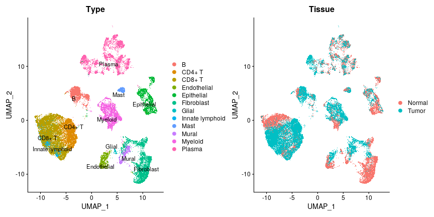
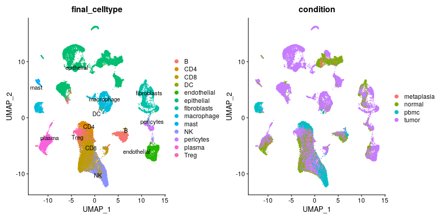
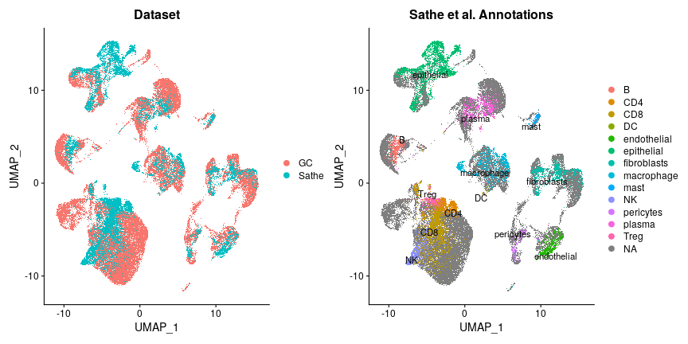
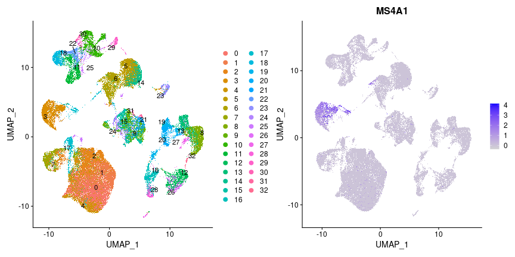

# Integrating with other gastric cancer atlas

In this demo, we integrate our dataset with the Sathe et al. gastric cancer single cell dataset. First, we load the gastric cancer dataset of this research into the environment. It can be loaded from the R data file `00.Processed Data/R_data.rds` or created using the normalized counts matrix and metadata we deposited on GEO.


```r
library(future)
library(future.apply)
library(readr)
library(dplyr)
library(tibble)
library(ggplot2)
library(Seurat)
options(future.globals.maxSize = 50*1024^3)
plan("multicore", workers = 8)

gcdata <- readRDS("R_data.rds")

p1 <- DimPlot(gcdata, reduction = "umap", group.by = "Type", label = TRUE, repel = TRUE)
p2 <- DimPlot(gcdata, reduction = "umap", group.by = "Tissue")
p1 + p2
```



If the data is loaded from the normalized counts matrix and metadata we deposited on GEO, the following processes can be used to generate the above UMAP dimensions. Since the differences between major cell types are significant, no special preprocessing or parameters are required.


```r
gcdata <- FindVariableFeatures(gcdata, verbose = FALSE)
gcdata <- RunPCA(gcdata, npcs = 30, verbose = FALSE)
gcdata <- RunUMAP(gcdata, reduction = "pca", dims = 1:30, verbose = FALSE)
```

Next, we download and prepare the Sathe et al. dataset.


```r
download.file("https://dna-discovery.stanford.edu/download/1403/", "filtered_matrix.zip", method = "curl", extra = '-k')
download.file("https://dna-discovery.stanford.edu/publicmaterial/datasets/gastric_scRNAseq/cell_labels.csv", "cell_labels.csv", method = "curl", extra = '-k')
unzip("filtered_matrix.zip", exdir = "sathe_matrix")
```

Since the data is raw unprocessed counts of each sample, it needs to be merged and processed with the basic workflow.


```r
sathe_meta <- read_csv("cell_labels.csv")
sathe_cells <- split(sathe_meta, sathe_meta$orig.ident)
sathe_matrices <- future_lapply(names(sathe_cells), function(x){
    mat <- Read10X(file.path('sathe_matrix', x))
    cells <- substr(sathe_cells[[x]]$cell_barcode, 1, 16)
    colnames(mat) <- substr(colnames(mat), 1, 16)
    mat <- mat[, cells]
    colnames(mat) <- sathe_cells[[x]]$cell_barcode
    mat
})
sathe_matrix <- Reduce(cbind, sathe_matrices)
sathe_metadata <- bind_rows(sathe_cells) %>% column_to_rownames("cell_barcode")

sathedata <- CreateSeuratObject(sathe_matrix, meta.data = sathe_metadata)
sathedata <- NormalizeData(sathedata, verbose = FALSE)
sathedata <- ScaleData(sathedata, verbose = FALSE)
sathedata <- FindVariableFeatures(sathedata, verbose = FALSE)
sathedata <- RunPCA(sathedata, npcs = 30, verbose = FALSE)
sathedata <- RunUMAP(sathedata, reduction = "pca", dims = 1:30, verbose = FALSE)

# Visualization
p1 <- DimPlot(sathedata, reduction = "umap", group.by = "final_celltype", label = TRUE, repel = TRUE)
p2 <- DimPlot(sathedata, reduction = "umap", group.by = "condition")
p1 + p2
```



Now, we perform data integration using the Seurat anchor-based method. Since both datasets are large, we adopt the RPCA method and reference-based workflow as explained [here](https://satijalab.org/seurat/articles/integration_large_datasets.html).


```r
gcdata$Dataset <- "GC"
sathedata$Dataset <- "Sathe"
object_list <- list(gcdata, sathedata)
anchors <- FindIntegrationAnchors(object.list = object_list, dims = 1:30, reference = 1, reduction = "rpca", verbose = FALSE)
integrated_data <- IntegrateData(anchorset = anchors, dims = 1:30, verbose = FALSE)
```

After integration, the two datasets are merged and can be used for downstream visualizations and investigations. We can easily interpret from the following analysis that the two datasets are merged based on the biological phenotypes of cells, and unique characteristics of small/rare cell populations, such as the DC population, are well preserved without any tweaking of parameters or manual correction of the data. In addition, the Sathe et al. dataset has more observations of the epithelial cells, while our data has more observations of plasma, fibroblast, B, and T cells.


```r
integrated_data <- ScaleData(integrated_data, verbose = FALSE)
integrated_data <- RunPCA(integrated_data, verbose = FALSE)
integrated_data <- RunUMAP(integrated_data, dims = 1:30, verbose = FALSE)

# Visualization
p1 <- DimPlot(integrated_data, reduction = "umap", group.by = "Dataset")
p2 <- DimPlot(integrated_data, reduction = "umap", group.by = "final_celltype", label = TRUE, repel = TRUE) + ggtitle("Sathe et al. Annotations")
p1 + p2
```



It is possible to perform further clustering and *de novo* identification of cell populations on the integrated dataset. In the following example, the B cell population can be independently identified using expression of *MS4A1*, and matched with cluster 3.


```r
integrated_data <- FindNeighbors(integrated_data, verbose = FALSE)
integrated_data <- FindClusters(integrated_data, verbose = FALSE)

# Visualization
p1 <- DimPlot(integrated_data, reduction = "umap", label = TRUE, repel = TRUE)
p2 <- FeaturePlot(integrated_data, "MS4A1")
p1 + p2
```



In summary, we demonstrated how to integrate our gastric cancer dataset with other single cell datasets. Apart from Seurat, other methods and workflows (such as [Harmony](https://github.com/immunogenomics/harmony), [Scanorama](https://github.com/brianhie/scanorama), [Monocle](http://cole-trapnell-lab.github.io/monocle-release/), [Scrattch](https://github.com/AllenInstitute/scrattch), etc) can be adopted to perform such integration. It is recommended to try different methods in such combinatorial analysis, in order to identify meaningful phenomena.


```r
sessionInfo()
```

```
## R version 4.1.2 (2021-11-01)
## Platform: x86_64-pc-linux-gnu (64-bit)
## Running under: Ubuntu 18.04.4 LTS
## 
## Matrix products: default
## BLAS:   /BGFS1/usr/share/packages/R/R-4.1.2/lib/R/lib/libRblas.so
## LAPACK: /BGFS1/usr/share/packages/R/R-4.1.2/lib/R/lib/libRlapack.so
## 
## locale:
##  [1] LC_CTYPE=en_US.UTF-8       LC_NUMERIC=C              
##  [3] LC_TIME=en_US.UTF-8        LC_COLLATE=en_US.UTF-8    
##  [5] LC_MONETARY=en_US.UTF-8    LC_MESSAGES=en_US.UTF-8   
##  [7] LC_PAPER=en_US.UTF-8       LC_NAME=C                 
##  [9] LC_ADDRESS=C               LC_TELEPHONE=C            
## [11] LC_MEASUREMENT=en_US.UTF-8 LC_IDENTIFICATION=C       
## 
## attached base packages:
## [1] stats     graphics  grDevices datasets  utils     methods   base     
## 
## other attached packages:
## [1] future.apply_1.8.1 SeuratObject_4.0.4 Seurat_4.1.0       ggplot2_3.3.5     
## [5] tibble_3.1.7       dplyr_1.0.9        readr_2.1.2        future_1.24.0     
## [9] knitr_1.37        
## 
## loaded via a namespace (and not attached):
##   [1] Rtsne_0.15            colorspace_2.0-3      deldir_1.0-6         
##   [4] ellipsis_0.3.2        ggridges_0.5.3        spatstat.data_2.1-2  
##   [7] farver_2.1.0          leiden_0.3.9          listenv_0.8.0        
##  [10] bit64_4.0.5           ggrepel_0.9.1         RSpectra_0.16-0      
##  [13] fansi_1.0.3           codetools_0.2-18      splines_4.1.2        
##  [16] polyclip_1.10-0       jsonlite_1.8.0        ica_1.0-2            
##  [19] cluster_2.1.2         png_0.1-7             uwot_0.1.11          
##  [22] shiny_1.7.1           sctransform_0.3.3     spatstat.sparse_2.1-0
##  [25] compiler_4.1.2        httr_1.4.2            assertthat_0.2.1     
##  [28] Matrix_1.3-4          fastmap_1.1.0         lazyeval_0.2.2       
##  [31] cli_3.3.0             later_1.3.0           htmltools_0.5.2      
##  [34] tools_4.1.2           igraph_1.3.1          gtable_0.3.0         
##  [37] glue_1.6.2            RANN_2.6.1            reshape2_1.4.4       
##  [40] Rcpp_1.0.8.2          scattermore_0.8       vctrs_0.4.1          
##  [43] nlme_3.1-153          lmtest_0.9-39         spatstat.random_2.1-0
##  [46] xfun_0.30             stringr_1.4.0         globals_0.14.0       
##  [49] mime_0.12             miniUI_0.1.1.1        lifecycle_1.0.1      
##  [52] irlba_2.3.5           renv_0.15.2           goftest_1.2-3        
##  [55] MASS_7.3-54           zoo_1.8-9             scales_1.1.1         
##  [58] vroom_1.5.7           spatstat.core_2.4-0   hms_1.1.1            
##  [61] promises_1.2.0.1      spatstat.utils_2.3-0  parallel_4.1.2       
##  [64] RColorBrewer_1.1-2    reticulate_1.24       pbapply_1.5-0        
##  [67] gridExtra_2.3         rpart_4.1-15          stringi_1.7.6        
##  [70] highr_0.9             rlang_1.0.2           pkgconfig_2.0.3      
##  [73] matrixStats_0.61.0    evaluate_0.15         lattice_0.20-45      
##  [76] ROCR_1.0-11           purrr_0.3.4           tensor_1.5           
##  [79] labeling_0.4.2        patchwork_1.1.1       htmlwidgets_1.5.4    
##  [82] bit_4.0.4             cowplot_1.1.1         tidyselect_1.1.2     
##  [85] parallelly_1.30.0     RcppAnnoy_0.0.19      plyr_1.8.6           
##  [88] magrittr_2.0.3        R6_2.5.1              generics_0.1.2       
##  [91] DBI_1.1.2             mgcv_1.8-38           pillar_1.7.0         
##  [94] withr_2.5.0           fitdistrplus_1.1-8    survival_3.2-13      
##  [97] abind_1.4-5           crayon_1.5.1          KernSmooth_2.23-20   
## [100] utf8_1.2.2            spatstat.geom_2.3-2   plotly_4.10.0        
## [103] tzdb_0.2.0            grid_4.1.2            data.table_1.14.2    
## [106] digest_0.6.29         xtable_1.8-4          tidyr_1.2.0          
## [109] httpuv_1.6.5          munsell_0.5.0         viridisLite_0.4.0
```


